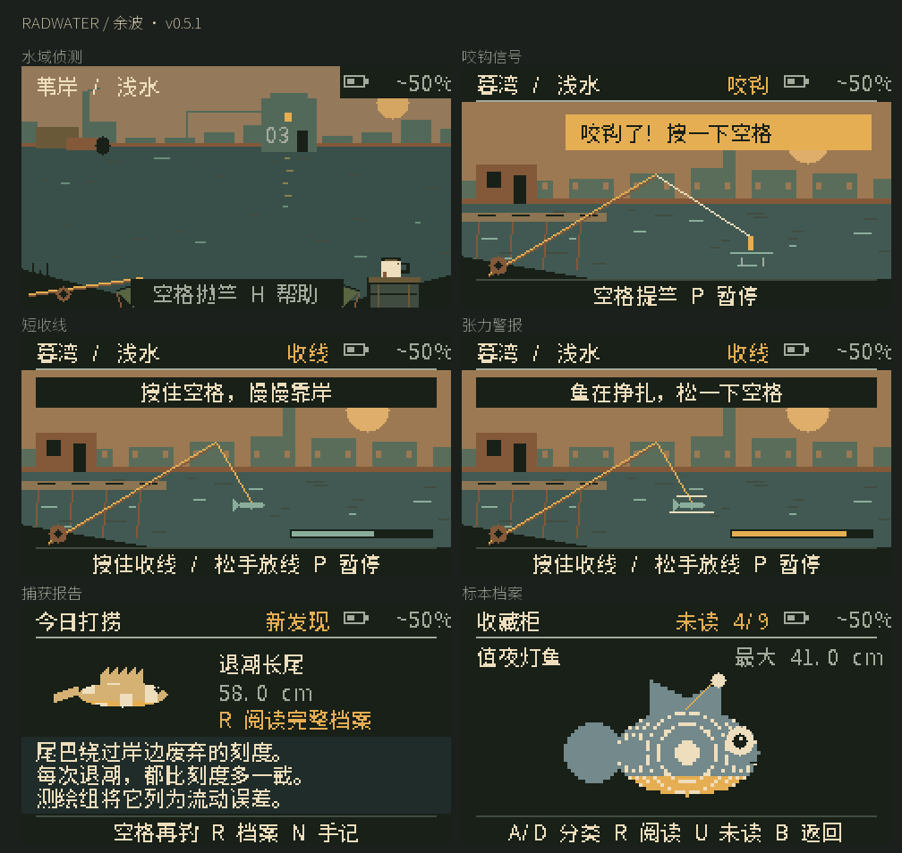
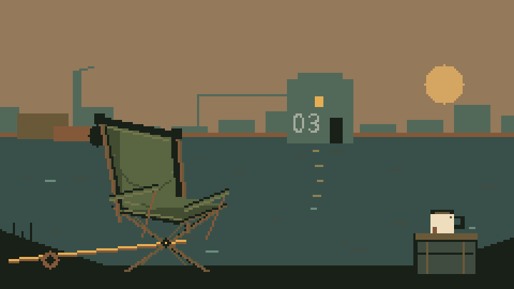
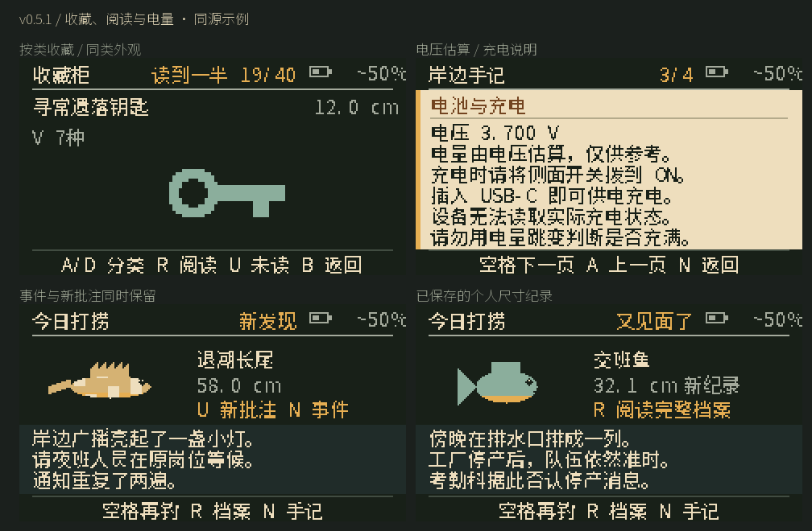

# Radwater · 余波

**水质尚未达标，垂钓照常进行。**

A pocket-sized wasteland fishing game for **M5Stack Cardputer ADV**. Catch strange things. Piece together what remains.

一款掌心里的废土钓鱼游戏。只用空格收放线，钓起奇怪的东西，慢慢拼出净水三号的往事。离线运行，通过 M5Launcher 安装。



## 开始钓鱼

**当前版本：v0.5.1** · 收藏与阅读整理、电量估算。

1. 下载 [Radwater-ADV-v0.5.1.bin](firmware/Radwater-ADV-v0.5.1.bin)。校验信息见 [固件清单](firmware/README.md)。
2. 把 BIN 放入已有 FAT32 SD 卡，例如 `/Games/`，在已有 **M5Launcher** 中选中安装。
3. 空格抛竿，咬钩再按一次；按住收线，挣扎时松一下，再收上来。

收藏按鱼种与物品类型浏览，V 查看同类外观；物品逐页记录阅读进度，U 直接打开未读内容或新批注。鱼有个人最大尺寸纪录。右上角显示估算电量，N 手记第三页查看电压与充电说明。原有短音效保留，默认静音，M 开启。

无需联网或额外资源文件。没有 SD 也能试钓，但不能保留收藏。镜像仅含 ESP32-S3 应用，不包含启动器或分区表。

**升级先备份 `/PocketFishing/`。** 渔获仍使用原路径和生成器 v3，与 v0.4.0–v0.4.5 兼容；新版阅读进度写入独立的 `reading-v2.pfn`。仅在新版文件不存在时只读导入旧手记，保留书签、事件与批注；旧物品的“已读”只证明打开过第一页，导入后可能显示“读到一半”。旧文件不改写，回退旧固件看不到本版新增阅读进度。v0.3.0 及更早固件不支持 v3 渔获。[完整安装与存档说明](docs/PLAYING.md)



开机约 2.6 秒，旧帆布椅已经摆好，稍后视角坐低。“坐会儿吧。”淡掉后，水面一直留着；空格随时直接抛竿。

## 在水边能遇到什么

- **短收线**：一次短挣扎，空格收放，不要求 A/D 追鱼。
- **16 种鱼**：各有独立档案与物品关联批注；尺寸仍随机。
- **24 类旧物**：768 种外观组合、48 份主档案、相互关联的物证与黑色幽默。
- **12 类随机事件**：排水、交班鱼群、无人广播、水下敲门……事件可以回看，少数影响接下来几竿。
- **三个废土钓点**：排水口、旧码头、深水浮标；发现线索后，岸边会悄悄变化。
- **随时放下**：阅读不倒计时，未及时提竿会暂停；未读提示、关联跳转和书签帮你接着读。

没有体力、签到或每日任务。只有这片水、一些旧东西，以及仍然有人值班的传闻。

## 常用按键

| 按键 | 用途 |
| --- | --- |
| 空格 / Enter | 抛竿、提竿、按住收线、翻页 |
| B / R | 收藏柜 / 完整档案 |
| N | 手记、最近十二条事件 |
| U / T / C | 直接读未读 / 跳转关联物品 / 继续上次阅读 |
| V | 收藏柜切换同类已收集外观 |
| F / 1、2、3 | 钓法 / 钓点 |
| P / H / M | 暂停 / 帮助 / 声音 |

详细规则与其他按键见 [玩法说明](docs/PLAYING.md)。

## Fish, files, and a little fallout

Radwater is an offline, story-focused fishing game with original wasteland fiction, light anomalous undertones, and bureaucratic dark humor. It is not an official Fallout or SCP game and contains no official story excerpts. No network, account, or cloud AI is required.

Hold **Space** to reel, release briefly when the fish struggles, then reel it in. Read dossiers with **R** and revisit events with **N**. **The current in-game text is Simplified Chinese.**

## 开发

```sh
python3 -m venv .venv
.venv/bin/python -m pip install -r requirements-dev.txt
sh tools/test.sh
.venv/bin/pio run
```

需要 Python 3.10+ 和 C++17 编译器。字体子集已在源码中，正常编译无需重新生成；完整预览和打包流程见 [开发说明](docs/DEVELOPMENT.md)。

- [验证记录](docs/VALIDATION.md)：自动化结果与真机验证边界。
- [鱼种预览](assets/fish.png) · [事件与场景预览](assets/features.png)。图片来自同一绘图代码，不是真机照片。
- [故事连续性](docs/STORY.md)：**含剧透**，建议先玩。
- [版本记录](CHANGELOG.md) · [第三方许可](THIRD_PARTY_NOTICES.md)。

v0.4.0 已由作者在 ADV 上安装并反馈观感良好；v0.5.1 完成主机逻辑、存档回归和固件构建验证。小字、按键手感、音频、SD 突然断电与续航仍需要更多实际测试。



## 电量与充电

`~50%` 表示按电压估算、取整到5%一档，不是精确剩余容量；`--` 表示读数不可用，不当成0%或100%。每5秒采样一次。插线、负载与电池状态会影响电压读数。

**Cardputer ADV 充电时，侧面开关必须在 ON。** OFF 时电池断开，USB只能给设备供电。硬件不能读取充电状态或电流，因此游戏不显示“正在充电”“充满”或剩余充电时间。[M5Stack 官方说明](https://docs.m5stack.com/en/arduino/m5cardputer/battery)
